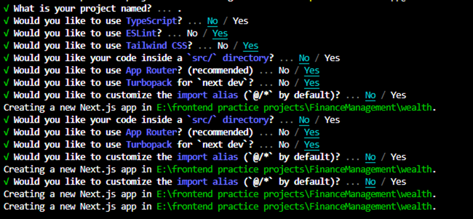

# Ai Finance Management Platform 
**Steps**
 npx create-next-app@latest



1.	https://ui.shadcn.com/  -- these are prebuild component which we can copy and paste and install in our apps
2.	Shadcian ui build on top of tailwind css Next.js
Install and configure shadcn/ui for Next.js.
3.	npx shadcn@latest init
4.	choose--   Use --legacy-peer-deps  -> so that all of the pkg compatible with react 19 and next.js 15
5.	npx shadcn@latest add button
6.	paste in postcss.config.mjs -> 
7.	const config = {  plugins: {    "@tailwindcss/postcss": {},  },};export default config;
8.	npx shadcn@latest add badge calendar card checkbox drawer dropdown-menu input                   popover progress select switch table tooltip
9.	 progress – used to  ->> to show the progress to what are budget right now
10.	Select – for from 


**Authentication login and signup**
User Management Platform  https://clerk.com/  
Signup then will get option----
1.	npm install @clerk/nextjs --legacy-peer-deps

2.	Set your Clerk API keys
.env variable  -> these are the secret keys which we used to connect to cleark server so that it can make our authentication possible 
3.	Update middleware.ts -> runs before our app runs, we need to initialized clerk that is our authentication before our app is loaded.
4.	Wrap app with cleark provider - layout.js
5.  Craeted Some Public Route And Private Route and Group them also.
6.  Created folder under app/(auth) --> and we wrap  --> so that this will not consider as a route.
7.  Also Ctreated Catch All Route --> It allow us to add after the url ex: sign-in, sign-up.
[[sign-in]] and moved in that page.jsx

**create root .env file**
NEXT_PUBLIC_CLERK_PUBLISHABLE_KEY=pk_test_ZGFybGluZy1kb3J5LTU4LmNsZXJrLmFjY291bnRzLmRldiQ
CLERK_SECRET_KEY=sk_test_ej02brilxzwBOe9XOdnNIkysllwgChU2vNW6HmtdBs
NEXT_PUBLIC_CLERK_SIGN_IN_URL=sign-in
NEXT_PUBLIC_CLERK_SIGN_UP_URL=sign-up


 https://clerk.com/   -- we will get on this website

## Clerk - Used for authontication
 Clerk is a authentication service that provides a simple and secure way to manage user authentication.

## We will Configure and add protected Roote 
- We will add a protected route to our middleware.js.

## Supabase [backed services]
- Supabase is a postfress SQL DB.
- we are using **prisma**, is more generic which allow us to connect any DB.
- let's we desided tommorrow we drop supabase or take any DB like any other custom mysql DB so we can do that.

## Arcjet [backed services]
- Will allows us to add security to our apps 
- It's Provides a Bot detection, Rate limiting, Email validation, Comman Attack Protection, Data redaction.
**Use**
- https://arcjet.com/ -> Signup 
- create new site name as **your site name**
- copy env and paste in your env file

## Inngest [backed services]
For Recalculating recurring transaction, Monthly financial reports to the user using AI also sending Budget alerts to the user.
- we need to give org name and skip others after signup and install the inngest also we will get (http://localhost:8288) to check development.
```bash
npx inngest-cli@latest dev
```

**Noet** : All setup are done
### Clinet Components
1.**Hero**
- Components > hero.jsx - This is a Clinet Components - This can contain frontend logic like using hooks  or others complex logic.
- which is not going to runningin our server.
- These are more **dynamic** pages because they run on the client (browser).
- And we can change or update them when the user clicks, types, or interacts with the page.

### Server Components
we have page.js - we impoted  **HeroSection**
- This are more **statics** pages
- The components that are rendered on the server — that is our backend, not on our client
- run on the backend , Used for static or data-loading parts.
- The code runs before it reaches the user’s browser — it runs on the hosting server (backend).

### Created landing Page

### Explain table


### Install Prisma
- Install and we will create all of the models for our DB.
``` bash 
npm install -D prisma --legacy-page-deps
npx prisma init
```
- Now it will create prisma/schema.prisma to (**Define models**) and prisma.config.ts. 
- It has taken DB url that we had set in .env.
- Also we had set Direct url.
- create all of the models for our DB in Prisma file.
``` bash 
npx prisma migrate dev --name create-models
npm i @prisma/client --legacy-peer-deps
npx prisma migrate dev --name create-models
```
- it will create migration folder inside prisma - all sql tables 
- Initializes prisma clinet
- Next For Auth user logic in will store automatic datad in our DB. -> checkUser.js
- created 404 own page
**Note:**
1. Dyanamic route - eg: app/(main)/account/page.jsx
2. Catch-all route - eg: pages/shop/[...slug].js and the **url** > /shop/a also **param** {slug: ['a']}

### Dashboard
**A.** Suspense -> This will show loading indicator / fallback UI
``` bash
npm i react-spinners --lagacy-peer--deps     
```
- It's provide us bunch of loders - we are using **Bar Loader**
**B.** DashboardPage - we will show our **budget progess**

**C.** Now Create **Server Action** -> APIs
- But in Next.js they are writeen just like normal function.
- Earlier we need to write somthing like /api/holder and we have to create a seprate route.
- Since Next.js 13 I belive we have the feature **Server Action**.
- Create new folder **Action** and we can write server side logic.
- file dashboard.js - server action for creating an **account** which will take some **data**.
- "use server" - at the begning of the file.
- Final UI -> CreateAccountDrawer
``` bash 
npm i react-hook-form zod @hookform/resolvers --legacy-per-deps
```
- react hook form -> Basically Manage a form
- zod -> validation library which will be handle all the error and validation for our form.
- hookform resolvers - helps us connect both of this.


